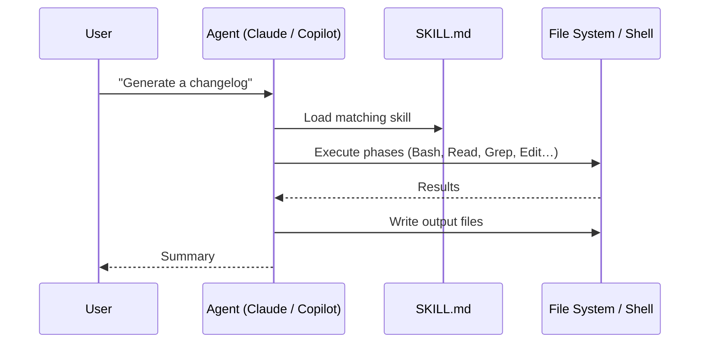

[← Back to README](../README.md)

# Architecture

## Overview

easier-life-skills is a content repository — there is no compiled code, no runtime, and no server. Each skill is a self-contained directory that an AI agent reads and executes directly.

```
easier-life-skills/
├── .claude-plugin/
│   ├── marketplace.json         Generated from plugins/ scan — committed; do not edit by hand
│   ├── bundles.json             Bundle definitions (curated skill sets)
│   └── external-overrides.json  Category overrides for external marketplace plugins/skills
├── plugins/
│   ├── changelog/
│   │   ├── .claude-plugin/
│   │   │   └── plugin.json  Plugin manifest — name, description, category, skills[], agents[]
│   │   ├── skills/
│   │   │   └── changelog/
│   │   │       └── SKILL.md Required — instructions the agent follows
│   │   ├── agents/          Optional — sub-agents spawned by the skill
│   │   │   └── <name>.md    Sub-agent definition (frontmatter + system prompt)
│   │   ├── references/      Optional — concise reference docs read at runtime
│   │   │   └── <topic>.md   Non-obvious, trap-prone facts (not LLM basics)
│   │   └── evals/
│   │       └── evals.json   Optional — test cases for the skill
│   └── <other-plugins>/     (same layout)
├── scripts/
│   ├── build-index.js       Orchestrator — scans plugins/, generates marketplace.json, writes skills_index.json + CATALOG.md
│   └── lib/
│       ├── fetch-marketplace.js  Fetches plugins from one repo; discovers skills/agents/mcpServers
│       ├── catalog.js            Generates CATALOG.md content
│       └── frontmatter.js        YAML frontmatter parser for SKILL.md files
├── assets/                  Website JS modules (loaded via GitHub Pages)
│   ├── app.js               Boot + event wiring
│   ├── api.js               Fetches skills_index.json from GitHub
│   ├── state.js             Shared mutable state (plugins, skills, agents, mcpServers, bundles)
│   ├── marketplace.js       Loads marketplace index into state
│   ├── panel.js             Plugin detail slide-in panel
│   ├── render.js            Renders plugin/skill/agent/mcpServer/bundle grids + filters
│   └── components.js        DOM builders for cards and source tags
├── installer/               npx CLI installer (@dan323/easier-life-skills)
├── marketplaces.json        List of { owner, repo, description? } pairs the build script aggregates
├── index.html               Interactive marketplace website
├── docs/
│   ├── getting-started.md
│   ├── architecture.md
│   └── contributing.md
├── CHANGELOG.md
└── README.md
```

## Build Pipeline

The build script is the only runtime component. It runs in CI (GitHub Actions) on every push to `master`:

```
plugins/*/plugin.json  →  build-index.js  →  .claude-plugin/marketplace.json  (committed back)
marketplaces.json      →                  →  skills_index.json                 (gitignored)
                                          →  CATALOG.md                        (gitignored)
```

1. **Scan `plugins/`** — `build-index.js` reads every `plugins/<name>/.claude-plugin/plugin.json`, derives `name`, `description`, `category`, `source`, and `homepage`, and writes `.claude-plugin/marketplace.json`. This file is committed back to the branch by CI if it changed.
2. **Aggregate** — `marketplaces.json` lists one or more `{ owner, repo }` pairs. For each, the script fetches (or reads locally) `.claude-plugin/marketplace.json`, then discovers skills, agents, and MCP servers per plugin.
3. **Discovery** — for each plugin, `fetch-marketplace.js` resolves skills, agents, and MCP servers:
   - If `skills` / `agents` is a string array in `plugin.json` or the marketplace entry, each element is a specific directory path containing `SKILL.md` / a `.md` agent file.
   - If the field is a string, it is treated as a parent directory to scan (subdirs = skills, `.md` files = agents). Uses the local filesystem or the GitHub Contents API for remote repos.
   - If absent, the default directories (`skills/`, `agents/`) are scanned.
   - MCP servers can be an object keyed by server name, a string path to a JSON file, or auto-loaded from `.mcp.json` at the plugin root.
4. **Categorise** — local plugins carry their `category` from `plugin.json`. External plugins use the category from the upstream `marketplace.json` if present; `.claude-plugin/external-overrides.json` supplements where the upstream does not declare one.
5. **Bundle membership** is attached to each skill from `.claude-plugin/bundles.json`.
6. `skills_index.json` and `CATALOG.md` are gitignored and rebuilt on every CI run; they are deployed to GitHub Pages with the static site assets.
7. The website loads `skills_index.json` at runtime. The marketplace list is fixed at build time.

## Plugin Schema

Each `plugin.json` declares what the plugin provides, including its category:

```json
{
  "name": "task-agent",
  "description": "Read tasks from agent-tasks.yml, implement each via an agent, and open PRs",
  "author": { "name": "dan323" },
  "category": "automation",
  "skills":   ["./skills/task-agent"],
  "agents":   ["./agents/copilot-review-fixer"]
}
```

The `category` field is the source of truth for categorisation. The build scans all `plugins/*/` directories and generates `.claude-plugin/marketplace.json` automatically:

```json
{
  "name": "easier-life-skills",
  "description": "...",
  "owner": { "name": "dan323" },
  "plugins": [
    {
      "name": "task-agent",
      "source": "./plugins/task-agent",
      "description": "...",
      "category": "automation",
      "homepage": "https://github.com/dan323/easier-life-skills/tree/master/plugins/task-agent"
    }
  ]
}
```

This file is committed to the repo (not gitignored) and kept up to date by CI on every push.

## How Skills Work

When a skill is installed, the AI agent loads its `SKILL.md` into context whenever it recognises a matching user request. The agent then follows the phases defined in that file, using only the tools listed in the frontmatter.



## Anatomy of a SKILL.md

Every `SKILL.md` has two parts:

### 1. YAML Frontmatter

```yaml
---
name: skill-name
description: >
  One-paragraph description used for skill matching.
  Include trigger phrases here — this is the primary
  mechanism that determines when the skill activates.
tools: Bash, Read, Write, Edit, Glob, Grep
metadata:
  version: 1.0
---
```

- **`name`** — identifier, matches the directory name
- **`description`** — the agent reads this to decide whether to invoke the skill; write it to match real user phrases
- **`tools`** — declares which Claude tools the skill may use; keep this minimal

### 2. Instruction Body

The body is structured as numbered phases. Each phase has:
- A goal statement
- Bash commands to run (with expected output or failure handling)
- Decision logic (if/else branches)
- Output format expectations

## Skill Design Principles

**Idempotent** — re-running a skill must not corrupt existing output. Use `Edit` over `Write` when a file already exists; check for duplicates before appending.

**Graceful degradation** — if an optional tool (`vulture`, `tsc`, `deadcode`) is unavailable, fall back to grep-based analysis rather than failing.

**Read-only by default** — skills that analyse code (find-dead-code, improve-logging) produce reports only. Skills that write files (changelog, document-project) still preserve all existing content.

**Framework-aware** — skills account for runtime patterns that make code appear unused (DI annotations, reflection, decorators) to avoid false positives.

## Sub-Agents

Skills can spawn sub-agents for complex or parallelisable work. Sub-agent definitions live in `plugins/<skill-name>/agents/` and follow the Claude Code sub-agent spec:

```markdown
---
name: copilot-review-fixer
description: What this agent does and when it should be used.
tools: Bash, Read, Edit, mcp__github__pull_request_read
background: true
---

System prompt body — the instructions the agent follows.
PLACEHOLDER variables are substituted by the caller before spawning.
```

The skill spawns them via the Agent tool:

```
subagent_type: "copilot-review-fixer"
prompt: "OWNER=dan323\nREPO_NAME=my-repo\n..."
run_in_background: true   # if the agent can run in parallel
```

**When to extract to a sub-agent:** only when the logic is substantial enough to maintain independently (complex wait/poll/fix loops, multi-step background workflows). Simple two-command phases are fine inline in `SKILL.md`.

## References

Skills can include reference docs in `plugins/<skill-name>/references/`. These are read by the agent at runtime when the task involves that topic.

**What belongs here:** only non-obvious, trap-prone facts the agent would otherwise get wrong — e.g., "always use `./mvnw`, never `mvn`", or "Jest breaks with `module: ESNext`; use a split `tsconfig.jest.json`".

**What does not belong here:** anything a capable LLM already knows (basic syntax, standard API signatures, common patterns).

## Evals

Each skill can have an `evals/evals.json` file that defines test scenarios:

```json
{
  "skill_name": "my-skill",
  "evals": [
    {
      "id": 0,
      "prompt": "The user prompt that triggers this scenario",
      "description": "What this test covers",
      "setup": "bash commands to create the test environment",
      "expected_output": "Description of what correct output looks like",
      "files": [],
      "assertions": [
        {
          "id": "assertion-id",
          "text": "Plain-language statement that must be true of the output"
        }
      ]
    }
  ]
}
```

Evals are run by the `skill-creator` skill, which spawns the skill against each test case and grades the assertions.

---

## See Also

- [Getting Started](getting-started.md) — install and first use
- [Contributing a Skill](contributing.md) — how to write a new skill
