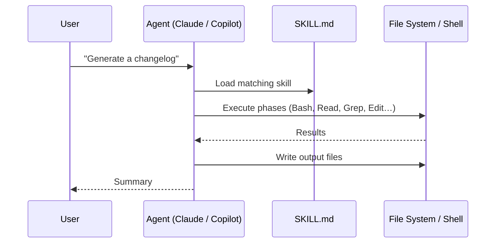

[← Back to README](../README.md)

# Architecture

## Overview

easier-life-skills is a content repository — there is no compiled code, no runtime, and no server. Each skill is a self-contained directory that an AI agent reads and executes directly.

```
easier-life-skills/
├── .claude-plugin/
│   ├── marketplace.json          Generated from plugins/ scan — committed; do not edit by hand
│   ├── bundles.json              Bundle definitions (curated skill sets)
│   └── external-overrides.json  Category overrides for external marketplace plugins/skills
├── plugins/
│   ├── changelog/
│   │   ├── .claude-plugin/
│   │   │   └── plugin.json  Plugin manifest — name, description, category, skills[], agents[]
│   │   ├── skills/
│   │   │   └── changelog/
│   │   │       └── SKILL.md Required — instructions the agent follows
│   │   ├── agents/          Optional — sub-agents spawned by the skill
│   │   │   └── <name>.md    Sub-agent definition (frontmatter + system prompt)
│   │   ├── references/      Optional — concise reference docs read at runtime
│   │   │   └── <topic>.md   Non-obvious, trap-prone facts (not LLM basics)
│   │   └── evals/
│   │       └── evals.json   Optional — test cases for the skill
│   └── <other-plugins>/     (same layout)
├── scripts/
│   ├── build-index.ts       Orchestrator — scans plugins/, generates marketplace.json, writes skills_index.json + CATALOG.md + catalog.html
│   └── lib/
│       ├── fetch-marketplace.ts  Fetches plugins from one repo; discovers skills/agents/mcpServers
│       ├── catalog.ts            Generates CATALOG.md (markdown) and catalog.html (styled standalone page)
│       ├── frontmatter.ts        YAML frontmatter parser for SKILL.md files
│       └── types.ts              Shared TypeScript types (Skill, Agent, Plugin, McpServer, Bundle…)
├── assets/
│   ├── src/                 TypeScript / Preact source for the website (compiled to bundle.js by esbuild)
│   │   ├── app.tsx          Boot — renders the <App> component into #root (esbuild entry point)
│   │   ├── api.ts           Fetches skills_index.json from GitHub
│   │   ├── constants.ts     Shared constants (e.g. BUILTIN_REPO)
│   │   ├── marketplace.ts   Pure data loader — returns { plugins, skills, agents, … , sources, meta } or an error envelope
│   │   ├── url-state.ts     readUrlState() / writeUrlState() — serialise filter/view/sort state to the URL hash
│   │   ├── utils.ts         copyText, titleCase helpers
│   │   ├── types.ts         Browser-side TypeScript types
│   │   └── components/      Preact components — each owns its own JSX, styles via assets/style.css
│   │       ├── App.tsx          Top-level state owner (useState/useLayoutEffect); composes the page
│   │       ├── Header.tsx       Title + GitHub button
│   │       ├── QuickStart.tsx   2-step install instructions
│   │       ├── Controls.tsx     Search input + sort + view toggle (7 tabs)
│   │       ├── Filters.tsx      Category filter bar
│   │       ├── MarketplaceBar.tsx Source tag row + Add-your-marketplace CTA
│   │       ├── Footer.tsx       Generated date + nav links
│   │       ├── Grid.tsx         Per-view grid (plugins / skills / agents / mcp / commands / hooks / bundles)
│   │       ├── PluginPanel.tsx  Plugin detail slide-in (right side); related skills/agents/MCP/commands/hooks, bundles, install rows
│   │       ├── EntityPanel.tsx  Skill/agent/MCP/command/hook detail slide-in (left side); tools, events, keywords, command, bundles
│   │       ├── CopyButton.tsx   Reusable copy-to-clipboard button with "Copied!" feedback
│   │       ├── Expandable.tsx   Reusable "+N more / Show less" wrapper
│   │       └── cards/           PluginCard, SkillCard, AgentCard, McpCard, CommandCard, HookCard, BundleCard
│   ├── bundle.js            Compiled output — gitignored, generated by npm run build
│   └── style.css            Website styles
├── tests/                   Vitest + happy-dom regression suite — boots the real app against fixtures/skills_index.json
│   ├── harness.ts           Boot helper: loads index.html, stubs fetch + clipboard, imports app.tsx
│   ├── fixtures/
│   │   └── skills_index.json    Fixture covering all 7 entity types across 3 source repos
│   └── *.test.ts            initial-render, search, sort, view-toggle, filters, plugin-panel, entity-panel, panel-interactivity, panel-card-install, url-state, copy-buttons
├── installer/               npx CLI installer (@dan323/easier-life-skills)
├── tsconfig.json            TypeScript config for scripts/ (NodeNext modules)
├── tsconfig.web.json        TypeScript config for assets/src/ (bundler resolution, DOM lib, Preact JSX)
├── vitest.config.ts         Vitest config — @preact/preset-vite for JSX, happy-dom environment
├── marketplaces.json        List of { owner, repo, description? } pairs the build script aggregates
├── index.html               Interactive marketplace website — minimal shell; markup is rendered by Preact at runtime
├── catalog.html             Generated standalone Skill Catalog page — gitignored, deployed to GitHub Pages
├── docs/
│   ├── getting-started.md
│   ├── architecture.md
│   └── contributing.md
├── CHANGELOG.md
└── README.md
```

## Web UI Architecture

The web UI uses **Preact** (3 KB) with the automatic JSX runtime. State lives in the top-level `<App>` component via `useState` hooks; URL state sync, the `/` keyboard shortcut, and the panels' Escape handlers use `useLayoutEffect` so behavior is observable synchronously after each event. Tests verify this contract: the regression tests in `tests/` boot the real bundle against a fixture and assert on user-visible DOM. `panel-interactivity.test.ts` additionally asserts DOM invariants (no `inert`/`aria-hidden="true"` ancestor of open panels, clean `#root` after close) — happy-dom silently ignores `inert`, so this attribute-level assertion is the only way to regression-test against accidentally freezing the app when a panel opens.

State flow:

```
URL hash  ⇄  readUrlState/writeUrlState  ⇄  App state (useState)
                                              │
                                              ▼
                                          <Grid> filters + sorts
                                          <PluginPanel> on click
                                          <EntityPanel> on click
```

There is no global state singleton. Components communicate only through props (downward) and callbacks (upward).

**Card interactivity.** Each card in `assets/src/components/cards/*` is a non-interactive `<div class="skill-card">`. The card title is the single interactive element: `<button class="card-name" onClick={openPanel}>`. A CSS "stretched link" overlay (`.card-name::after { position: absolute; inset: 0; }` over `.skill-card { position: relative; }`) makes the entire card area route clicks to the title button without nesting any focusable element inside an interactive ancestor — required for WCAG 4.1.2 (no nested-interactive). The copy button and `+N more` expand button are siblings of the title (lifted above the overlay with `position: relative; z-index: 1` on `.card-install` / `.plugin-chips` / `.card-chips`), so they remain independently clickable and keyboard-reachable. When the card needs to link out to the source repo, that link lives only inside the open panel (`panel-name` / Source section), not on the card.

**Marketplace source tag.** `MarketplaceBar.tsx` uses the same stretched-link pattern. The chip wrapper `<div class="source-tag">` is non-interactive; the filter toggle is a `<button class="source-toggle" aria-pressed>` containing the `.label`, and the `+` copy button is a sibling. `.source-toggle::after` makes clicks anywhere on the chip body toggle the filter; `.source-add-copy` is lifted with `z-index: 1` so it remains the only clickable element in its area. This replaced an older structure with `<div role="button" tabindex="0">` that nested the copy button inside an interactive container.

### Local development

```bash
npm run dev   # http://127.0.0.1:4567/ with auto-rebuild + live reload
```

`npm run dev` runs `tsx scripts/build-index.ts` once (to fetch `skills_index.json`), then starts esbuild's built-in serve mode. `index.html` contains a tiny inline snippet that subscribes to esbuild's `/esbuild` SSE endpoint and reloads on every rebuild — active only on `localhost`/`127.0.0.1`, so it is a no-op on GitHub Pages.

## Build Pipeline

The build pipeline runs in CI (GitHub Actions) on every push to `master` via `npm run build`:

```
plugins/*/plugin.json  →  build-index.ts  →  .claude-plugin/marketplace.json  (committed back)
marketplaces.json      →  (tsx)           →  skills_index.json                 (gitignored)
                                          →  CATALOG.md                        (gitignored)
                                          →  catalog.html                      (gitignored)
assets/src/app.tsx     →  esbuild (JSX)   →  assets/bundle.js                  (gitignored)
```

1. **Scan `plugins/`** — `build-index.ts` reads every `plugins/<name>/.claude-plugin/plugin.json`, derives `name`, `description`, `category`, `source`, and `homepage`, and writes `.claude-plugin/marketplace.json`. This file is committed back to the branch by CI if it changed.
2. **Aggregate** — `marketplaces.json` lists one or more `{ owner, repo }` pairs. For each, the script fetches (or reads locally) `.claude-plugin/marketplace.json`, then discovers skills, agents, and MCP servers per plugin.
3. **Discovery** — for each plugin, `fetch-marketplace.ts` resolves skills, agents, and MCP servers:
   - If `skills` / `agents` is a string array in `plugin.json` or the marketplace entry, each element is a specific directory path containing `SKILL.md` / a `.md` agent file.
   - If the field is a string, it is treated as a parent directory to scan (subdirs = skills, `.md` files = agents). Uses the local filesystem or the GitHub Trees API (one recursive fetch per repo) for remote repos.
   - If absent, the default directories (`skills/`, `agents/`) are scanned.
   - MCP servers can be an object keyed by server name, a string path to a JSON file, or auto-loaded from `.mcp.json` at the plugin root.
4. **Categorise** — local plugins carry their `category` from `plugin.json`. External plugins use the category from the upstream `marketplace.json` if present; `.claude-plugin/external-overrides.json` supplements where the upstream does not declare one.
5. **Read-only tagging** — a skill is tagged `readOnly` when its `tools` frontmatter declares tools but none of them are `Write`, `Edit`, or `NotebookEdit`.
6. **Bundle membership** is attached to each skill from `.claude-plugin/bundles.json`.
7. `skills_index.json`, `CATALOG.md`, `catalog.html`, and `assets/bundle.js` are gitignored and rebuilt on every CI run; they are deployed to GitHub Pages with the static site assets.
8. The website loads `skills_index.json` at runtime. The marketplace list is fixed at build time. Active filters, view, search query, and sort direction are synced to the URL hash so filtered states are shareable. The footer's `Full catalog` link points at the in-site `./catalog.html` rendered by `scripts/lib/catalog.ts#generateCatalogHtml`.

## Plugin Schema

Each `plugin.json` declares what the plugin provides, including its category:

```json
{
  "name": "task-agent",
  "description": "Read tasks from agent-tasks.yml, implement each via an agent, and open PRs",
  "author": { "name": "dan323" },
  "category": "automation",
  "skills": ["./skills/task-agent"]
}
```

Sub-agents in `plugins/<name>/agents/` are auto-discovered by Claude Code from that directory and do not need to be declared in `plugin.json`. The `agents` array field is not supported in the current plugin manifest schema.

The `category` field is the source of truth for categorisation. The build scans all `plugins/*/` directories and generates `.claude-plugin/marketplace.json` automatically:

```json
{
  "name": "easier-life-skills",
  "description": "...",
  "owner": { "name": "dan323" },
  "plugins": [
    {
      "name": "task-agent",
      "source": "./plugins/task-agent",
      "description": "...",
      "category": "automation",
      "homepage": "https://github.com/dan323/easier-life-skills/tree/master/plugins/task-agent"
    }
  ]
}
```

This file is committed to the repo (not gitignored) and kept up to date by CI on every push.

## How Skills Work

When a skill is installed, the AI agent loads its `SKILL.md` into context whenever it recognises a matching user request. The agent then follows the phases defined in that file, using only the tools listed in the frontmatter.


```mermaid
sequenceDiagram
    participant U as User
    participant A as Agent (Claude / Copilot)
    participant S as SKILL.md
    participant FS as File System / Shell

    U->>A: "Generate a changelog"
    A->>S: Load matching skill
    A->>FS: Execute phases (Bash, Read, Grep, Edit…)
    FS-->>A: Results
    A->>FS: Write output files
    A-->>U: Summary
```

## Anatomy of a SKILL.md

Every `SKILL.md` has two parts:

### 1. YAML Frontmatter

```yaml
---
name: skill-name
description: >
  One-paragraph description used for skill matching.
  Include trigger phrases here — this is the primary
  mechanism that determines when the skill activates.
tools: Bash, Read, Write, Edit, Glob, Grep
metadata:
  version: 1.0
---
```

- **`name`** — identifier, matches the directory name
- **`description`** — the agent reads this to decide whether to invoke the skill; write it to match real user phrases
- **`tools`** — declares which Claude tools the skill may use; keep this minimal

### 2. Instruction Body

The body is structured as numbered phases. Each phase has:
- A goal statement
- Bash commands to run (with expected output or failure handling)
- Decision logic (if/else branches)
- Output format expectations

## Skill Design Principles

**Idempotent** — re-running a skill must not corrupt existing output. Use `Edit` over `Write` when a file already exists; check for duplicates before appending.

**Graceful degradation** — if an optional tool (`vulture`, `tsc`, `deadcode`) is unavailable, fall back to grep-based analysis rather than failing.

**Read-only by default** — skills that analyse code (find-dead-code, improve-logging) produce reports only and declare no `Write` or `Edit` tools. The build pipeline detects this automatically from the `tools` frontmatter. Skills that write files (changelog, document-project) still preserve all existing content.

**Framework-aware** — skills account for runtime patterns that make code appear unused (DI annotations, reflection, decorators) to avoid false positives.

## Sub-Agents

Skills can spawn sub-agents for complex or parallelisable work. Sub-agent definitions live in `plugins/<skill-name>/agents/` and follow the Claude Code sub-agent spec:

```markdown
---
name: copilot-review-fixer
description: What this agent does and when it should be used.
tools: Bash, Read, Edit, mcp__github__pull_request_read
background: true
---

System prompt body — the instructions the agent follows.
PLACEHOLDER variables are substituted by the caller before spawning.
```

The skill spawns them via the Agent tool:

```
subagent_type: "copilot-review-fixer"
prompt: "OWNER=dan323\nREPO_NAME=my-repo\n..."
run_in_background: true   # if the agent can run in parallel
```

**When to extract to a sub-agent:** only when the logic is substantial enough to maintain independently (complex wait/poll/fix loops, multi-step background workflows). Simple two-command phases are fine inline in `SKILL.md`.

## References

Skills can include reference docs in `plugins/<skill-name>/references/`. These are read by the agent at runtime when the task involves that topic.

**What belongs here:** only non-obvious, trap-prone facts the agent would otherwise get wrong — e.g., "always use `./mvnw`, never `mvn`", or "Jest breaks with `module: ESNext`; use a split `tsconfig.jest.json`".

**What does not belong here:** anything a capable LLM already knows (basic syntax, standard API signatures, common patterns).

## Evals

Each skill can have an `evals/evals.json` file that defines test scenarios:

```json
{
  "skill_name": "my-skill",
  "evals": [
    {
      "id": 0,
      "prompt": "The user prompt that triggers this scenario",
      "description": "What this test covers",
      "setup": "bash commands to create the test environment",
      "expected_output": "Description of what correct output looks like",
      "files": [],
      "assertions": [
        {
          "id": "assertion-id",
          "text": "Plain-language statement that must be true of the output"
        }
      ]
    }
  ]
}
```

Evals are run by the `skill-creator` skill, which spawns the skill against each test case and grades the assertions.

---

## See Also

- [Getting Started](getting-started.md) — install and first use
- [Contributing a Skill](contributing.md) — how to write a new skill
