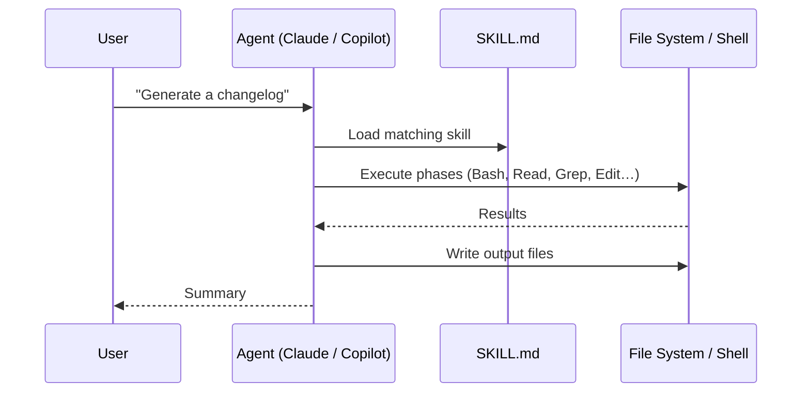
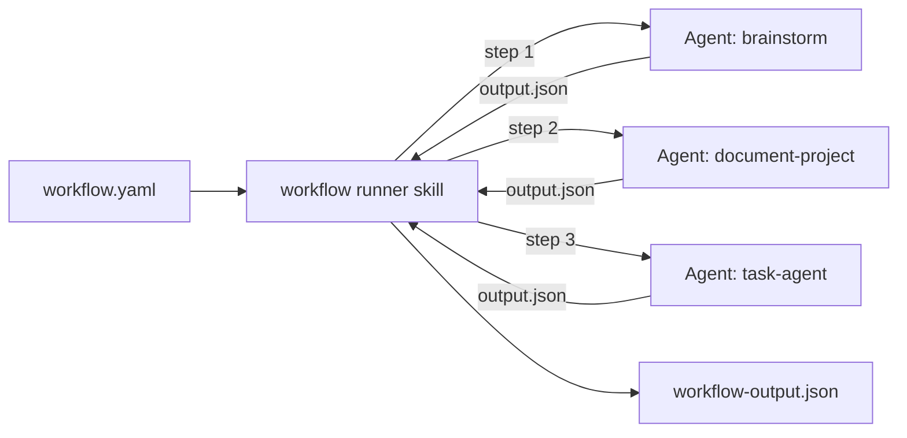

[← Back to README](../README.md)

# Architecture

## Overview

easier-life-skills is a content repository — there is no compiled code, no runtime, and no server. Each skill is a self-contained directory that an AI agent reads and executes directly.

```
easier-life-skills/
├── .claude-plugin/
│   ├── marketplace.json          Generated from plugins/ scan — committed; do not edit by hand
│   ├── bundles.json              Bundle definitions (curated skill sets)
│   └── external-overrides.json  Category overrides per entity type (plugins/skills/agents/hooks/commands/mcpServers) for external repos
├── plugins/
│   ├── brainstorm/                    Single-skill plugin (one SKILL.md, plugin name == skill name)
│   │   ├── .claude-plugin/
│   │   │   └── plugin.json            Plugin manifest — name, description, category, skills[], agents[]
│   │   ├── skills/
│   │   │   └── brainstorm/
│   │   │       ├── SKILL.md           Required — instructions the agent follows
│   │   │       └── evals/
│   │   │           └── evals.json     Optional — test cases for the skill
│   │   ├── agents/                    Optional — sub-agents spawned by the skill
│   │   │   └── <name>.md              Sub-agent definition (frontmatter + system prompt)
│   │   └── references/                Optional — concise reference docs read at runtime
│   │       └── <topic>.md             Non-obvious, trap-prone facts (not LLM basics)
│   ├── docs/                          Multi-skill bundle plugin — plugin.json lists every skill folder under skills/
│   │   ├── .claude-plugin/
│   │   │   └── plugin.json            "skills": ["./skills/changelog", "./skills/document-project"]
│   │   └── skills/
│   │       ├── changelog/
│   │       │   ├── SKILL.md
│   │       │   └── evals/evals.json
│   │       └── document-project/
│   │           ├── SKILL.md
│   │           └── evals/evals.json
│   ├── code-audit/                    Another multi-skill bundle — three read-only code-quality auditors
│   │   ├── .claude-plugin/
│   │   │   └── plugin.json            "skills": ["./skills/find-dead-code", "./skills/find-breaking-rest-api", "./skills/improve-logging"]
│   │   └── skills/
│   │       ├── find-dead-code/        SKILL.md + evals/
│   │       ├── find-breaking-rest-api/
│   │       └── improve-logging/
│   └── <other-plugins>/               (same layout — single- or multi-skill)
├── scripts/
│   ├── build-index.ts       Orchestrator — scans plugins/, generates marketplace.json, writes skills_index.json + CATALOG.md + catalog.html
│   └── lib/
│       ├── fetch-marketplace.ts  Fetches plugins from one repo; discovers skills/agents/mcpServers
│       ├── catalog.ts            Generates CATALOG.md (markdown) and catalog.html (styled standalone page)
│       ├── frontmatter.ts        YAML frontmatter parser for SKILL.md files (scalars, inline `[a, b]` arrays, block-mapping children, `>`-folded multi-line strings)
│       └── types.ts              Shared TypeScript types (Skill, Agent, Plugin, McpServer, Bundle…)
├── assets/
│   ├── src/                 TypeScript / Preact source for the website (compiled to bundle.js by esbuild)
│   │   ├── app.tsx          Boot — renders the <App> component into #root (esbuild entry point)
│   │   ├── analytics.ts     Optional GA4 wiring — gated on the GA_ID build-time define
│   │   ├── api.ts           Fetches skills_index.json from GitHub
│   │   ├── constants.ts     Shared constants (e.g. BUILTIN_REPO)
│   │   ├── marketplace.ts   Pure data loader — returns { plugins, skills, agents, … , sources, meta } or an error envelope
│   │   ├── url-state.ts     readUrlState() / writeUrlState() — serialise filter/view/sort state to the URL hash
│   │   ├── utils.ts         copyText, titleCase helpers
│   │   ├── types.ts         Browser-side TypeScript types
│   │   └── components/      Preact components — each owns its own JSX, styles via assets/style.css
│   │       ├── App.tsx          Top-level state owner (useState/useLayoutEffect); composes the page
│   │       ├── Header.tsx       Title + GitHub button
│   │       ├── QuickStart.tsx   2-step install instructions
│   │       ├── Controls.tsx     Search input + sort + view toggle (7 tabs)
│   │       ├── Filters.tsx      Category filter bar
│   │       ├── MarketplaceBar.tsx Source tag row + Add-your-marketplace CTA
│   │       ├── Footer.tsx       Generated date + nav links
│   │       ├── Grid.tsx         Per-view grid (plugins / skills / agents / mcp / commands / hooks / bundles)
│   │       ├── PluginPanel.tsx  Plugin detail slide-in (right side); related skills/agents/MCP/commands/hooks, bundles, install rows
│   │       ├── EntityPanel.tsx  Skill/agent/MCP/command/hook detail slide-in (left side); tools, events, keywords, command, bundles
│   │       ├── CopyButton.tsx   Reusable copy-to-clipboard button with "Copied!" feedback
│   │       ├── Expandable.tsx   Reusable "+N more / Show less" wrapper
│   │       └── cards/           PluginCard, SkillCard, AgentCard, McpCard, CommandCard, HookCard, BundleCard
│   ├── bundle.js            Compiled output — gitignored, generated by npm run build
│   └── style.css            Website styles
├── tests/                   Vitest + happy-dom regression suite — boots the real app against fixtures/skills_index.json
│   ├── harness.ts           Boot helper: loads index.html, stubs fetch + clipboard, imports app.tsx
│   ├── fixtures/
│   │   └── skills_index.json    Fixture covering all 7 entity types across 3 source repos
│   └── *.test.ts            initial-render, search, sort, view-toggle, filters, plugin-panel, entity-panel, panel-interactivity, panel-card-install, url-state, copy-buttons
├── installer/               npx CLI installer (@dan323/easier-life-skills)
├── tsconfig.json            TypeScript config for scripts/ (NodeNext modules)
├── tsconfig.web.json        TypeScript config for assets/src/ (bundler resolution, DOM lib, Preact JSX)
├── assets/tsconfig.json     IDE-facing config — extends ../tsconfig.web.json so IntelliJ walking up from
│                            assets/src/**.tsx finds JSX settings (the non-default tsconfig.web.json name
│                            is not auto-discovered). Not used by `npm run typecheck`.
├── vitest.config.ts         Vitest config — @preact/preset-vite for JSX, happy-dom environment
├── marketplaces.json        List of { owner, repo, description? } pairs the build script aggregates
├── index.html               Interactive marketplace website — minimal shell; markup is rendered by Preact at runtime
├── catalog.html             Generated standalone Skill Catalog page — gitignored, deployed to GitHub Pages
├── docs/
│   ├── getting-started.md
│   ├── architecture.md
│   └── contributing.md
├── CHANGELOG.md
└── README.md
```

## Web UI Architecture

The web UI uses **Preact** (3 KB) with the automatic JSX runtime. State lives in the top-level `<App>` component via `useState` hooks; URL state sync, the `/` keyboard shortcut, and the panels' Escape handlers use `useLayoutEffect` so behavior is observable synchronously after each event. Tests verify this contract: the regression tests in `tests/` boot the real bundle against a fixture and assert on user-visible DOM. `panel-interactivity.test.ts` additionally asserts DOM invariants (no `inert`/`aria-hidden="true"` ancestor of open panels, clean `#root` after close) — happy-dom silently ignores `inert`, so this attribute-level assertion is the only way to regression-test against accidentally freezing the app when a panel opens.

State flow:

```
URL hash  ⇄  readUrlState/writeUrlState  ⇄  App state (useState)
                                              │
                                              ▼
                                          <Grid> filters + sorts
                                          <PluginPanel> on click
                                          <EntityPanel> on click
```

There is no global state singleton. Components communicate only through props (downward) and callbacks (upward).

**Card interactivity.** Each card in `assets/src/components/cards/*` is a non-interactive `<div class="skill-card">`. The card title is the single interactive element: `<button class="card-name" onClick={openPanel}>`. A CSS "stretched link" overlay (`.card-name::after { position: absolute; inset: 0; }` over `.skill-card { position: relative; }`) makes the entire card area route clicks to the title button without nesting any focusable element inside an interactive ancestor — required for WCAG 4.1.2 (no nested-interactive). The copy button and `+N more` expand button are siblings of the title (lifted above the overlay with `position: relative; z-index: 1` on `.card-install` / `.plugin-chips` / `.card-chips`), so they remain independently clickable and keyboard-reachable. When the card needs to link out to the source repo, that link lives only inside the open panel (`panel-name` / Source section), not on the card.

The card title carries a `.card-name-chevron` (`›`, `aria-hidden`) so users see at a glance that activation opens an in-page panel rather than navigating to a separate URL — without the chevron the title is indistinguishable from a regular hyperlink. Keyboard focus on `.card-name` paints a two-tone ring on the same `::after` overlay (`box-shadow: 0 0 0 2px var(--bg), 0 0 0 4px var(--accent)` on `:focus-visible`), so the focus halo traces the full card body the button activates rather than the inline title text. The same pattern applies to `.source-toggle:focus-visible::after` on marketplace chips. This satisfies WCAG 2.4.7 / 2.4.11 while keeping the stretched-link click area working.

**Marketplace source tag.** `MarketplaceBar.tsx` uses the same stretched-link pattern. The chip wrapper `<div class="source-tag">` is non-interactive; the filter toggle is a `<button class="source-toggle" aria-pressed>` containing the `.label`, and the `+` copy button is a sibling. `.source-toggle::after` makes clicks anywhere on the chip body toggle the filter; `.source-add-copy` is lifted with `z-index: 1` so it remains the only clickable element in its area. This replaced an older structure with `<div role="button" tabindex="0">` that nested the copy button inside an interactive container.

**Search form.** `Controls.tsx`'s `<form role="search">` filters live on every `onInput`, but the form also carries an explicit `<button type="submit" class="sr-only">Search</button>` and an `onSubmit={e => e.preventDefault()}` handler so keyboard / AT users can fire the form via Enter (WCAG 3.2.2) without the page rewriting the URL with a stray `?`.

**Semantic landmarks.** Every top-level page region is wrapped in a recognised landmark so assistive-tech landmark navigation reaches all content (WCAG 1.3.1, axe `region` rule). `Header.tsx` → `<header>`; `Footer.tsx` → `<footer>`; the grid lives inside `<main id="main">` in `App.tsx`; `QuickStart.tsx` uses `<section class="quickstart" aria-labelledby="quickstart-heading">` (a `<section>` only counts as a landmark when accessibly named, hence the matching `<h2 id="quickstart-heading">`); `Controls.tsx` uses `<section class="controls" aria-label="Filters and view">`; `MarketplaceBar.tsx` uses `<nav class="marketplace-bar" aria-label="Marketplaces">`. These are element-name swaps only — visible HTML, IDs, and CSS classes are unchanged, so all existing styling and selectors keep working.

**Loading state and CLS.** `App.tsx` owns a `loaded: boolean` state that flips to `true` after `loadMarketplace()` resolves (success path *and* error path, so a failing fetch doesn't leave a permanent skeleton). The `Grid` component routes `!loaded` to a dedicated `<SkeletonGrid>` that renders the active view's grid container (with its real id, e.g. `#plugins-grid`) populated by 6 `.skeleton-card` placeholders. `.skeleton-card` has the same `min-height`, border-radius, border, and background as a real `.skill-card` so the grid reserves space and the layout doesn't shift when real cards arrive. Beyond the grid, `.marketplace-bar` and `.controls` carry `min-height` reservations (and `.search-wrap` uses `flex: 0 1 340px` rather than `flex: 1`) so the marketplace-bar wrap, the category-filter row that materialises on load, and the search-input stretch do not push `<main>` down. The result: Lighthouse Desktop 100, Mobile 99, both with `CLS` under 0.05. A `prefers-reduced-motion: reduce` rule disables the placeholder pulse.

**Empty-state messaging.** `Grid.tsx` exposes a single `viewEmpty(view, icon, label, allCount, data)` helper. When `allCount === 0` (the view has no items in the loaded dataset at all — common for the Commands/Hooks views of marketplaces that don't define any), it renders an `.empty-hint` line that names up to three other views which DO have items, pointing the user at a productive next step. When `allCount > 0` but filters drop everything (`filtered.length === 0`), the message keeps the existing "match your search" wording — the user can clear filters/search. `tests/empty-state.test.ts` covers both branches against a fixture variant that strips commands+hooks.

**Production bundle.** `npm run build` passes `--minify` to esbuild (Dev does not, so source-mapped DX is preserved). `index.html` declares `<link rel="modulepreload" href="assets/bundle.js" />` so the browser starts the bundle fetch in parallel with HTML parsing, cutting time-to-first-render of the Preact tree.

### Local development

```bash
npm run dev   # http://127.0.0.1:4567/ with auto-rebuild + live reload
```

`npm run dev` runs `tsx scripts/build-index.ts` once (to fetch `skills_index.json`), then starts esbuild's built-in serve mode. `index.html` contains a tiny inline snippet that subscribes to esbuild's `/esbuild` SSE endpoint and reloads on every rebuild — active only on `localhost`/`127.0.0.1`, so it is a no-op on GitHub Pages.

## Build Pipeline

The build pipeline runs in CI (GitHub Actions) on every push to `master` via `npm run build`:

```
plugins/*/plugin.json  →  build-index.ts  →  .claude-plugin/marketplace.json  (committed back)
marketplaces.json      →  (tsx)           →  skills_index.json                 (gitignored)
                                          →  CATALOG.md                        (gitignored)
                                          →  catalog.html                      (gitignored)
assets/src/app.tsx     →  esbuild (JSX)   →  assets/bundle.js                  (gitignored)
```

1. **Scan `plugins/`** — `build-index.ts` reads every `plugins/<name>/.claude-plugin/plugin.json`, derives `name`, `description`, `category`, `source`, and `homepage`, and writes `.claude-plugin/marketplace.json`. This file is committed back to the branch by CI if it changed.
2. **Aggregate** — `marketplaces.json` lists one or more `{ owner, repo }` pairs. For each, the script fetches (or reads locally) `.claude-plugin/marketplace.json`, then discovers skills, agents, and MCP servers per plugin.
3. **Discovery** — for each plugin, `fetch-marketplace.ts` resolves skills, agents, and MCP servers:
   - If `skills` / `agents` is a string array in `plugin.json` or the marketplace entry, each element is a specific directory path containing `SKILL.md` / a `.md` agent file.
   - If the field is a string, it is treated as a parent directory to scan (subdirs = skills, `.md` files = agents). Uses the local filesystem or the GitHub Trees API (one recursive fetch per repo) for remote repos.
   - If absent, the default directories (`skills/`, `agents/`) are scanned.
   - MCP servers can be an object keyed by server name, a string path to a JSON file, or auto-loaded from `.mcp.json` at the plugin root.
4. **Categorise** — every entity carries a `category` field. Plugins and skills derive theirs from `plugin.json`; agents, hooks, commands, and MCP servers inherit it from their parent plugin, but agents/hooks/commands may override via a `category:` field in their YAML frontmatter. `.claude-plugin/external-overrides.json` supplements all of these per entity type (`plugins`, `skills`, `agents`, `hooks`, `commands`, `mcpServers`) when an upstream marketplace does not declare one. Resolution order, applied per entity: external override → frontmatter (where applicable) → parent plugin category → `null` ("Uncategorized").
5. **Read-only tagging** — a skill is tagged `readOnly` when its `tools` frontmatter declares tools but none of them are `Write`, `Edit`, or `NotebookEdit`.
6. **Bundle membership** is attached to each skill from `.claude-plugin/bundles.json`. A bundle's `skills` array holds heterogeneous refs: a bare string `"foo"` matches every skill named `foo` across marketplaces (the common case — used by every existing bundle today), and an object `{ name, source?: { owner, repo }, pluginName? }` narrows by repo and/or plugin when two plugins ship a same-named skill. Resolution is centralised in `scripts/lib/bundle-resolve.ts` and its runtime twin `assets/src/bundle-resolve.ts`, so build-time tagging (`build-index.ts`), CATALOG/HTML rendering (`scripts/lib/catalog.ts`), and the web BundleCard agree on what a ref expands to. The resolver returns all matching skills (deduped by `(repo, pluginName, name)`), so a string ref still collapses N skills sharing a plugin to one install line. For plugin-only sources (see step 7) the BundleCard/CATALOG emit a shim hint instead of a `/plugin install` line that wouldn't resolve. A single bundle can mix skills from multiple marketplaces (e.g. the `skill-author` bundle pulls from `easier-life-skills`, `anthropics/skills`, `mattpocock/skills`, and `obra/superpowers`).
7. **Marketplace vs plugin-only sources** — `fetch-marketplace.ts` first tries `.claude-plugin/marketplace.json` and falls back to `.claude-plugin/plugin.json` for repos that are a single plugin (currently `mattpocock/skills`). The result is recorded in `skills_index.json` under `meta.sources[<owner/repo>].isMarketplace`. The npx installer (`installer/src/bin/install.ts`, compiled to `installer/dist/bin/install.js`) reads this flag to route each install: marketplace sources go through `claude plugin marketplace add <owner>/<repo>` + `claude plugin install <pluginName>@<repo>`; plugin-only sources get a per-plugin **synthetic shim marketplace** written under `~/.config/easier-life-skills/shims/<pluginName>/.claude-plugin/marketplace.json` whose single plugin entry uses Claude Code's `source: { source: "url", url: ... }` resolver — the shim is registered via `claude plugin marketplace add <shim-path>` (Claude Code accepts local-path marketplaces) and the plugin is installed as `<pluginName>@<pluginName>`. Either way, the plugin lands in `~/.claude/plugins/cache/<marketplace>/<plugin>/<version>/` and is registered in `installed_plugins.json`, so `claude plugin list` / `update` / `uninstall` work uniformly. The website's BundleCard makes the same distinction, defaulting to a single `npx … --bundle <id>` line for cross-source bundles and offering the per-source install commands (or a "this needs a shim, run the npx command" hint for plugin-only sources) behind a `<details>` toggle.
8. `skills_index.json`, `CATALOG.md`, `catalog.html`, and `assets/bundle.js` are gitignored and rebuilt on every CI run; they are deployed to GitHub Pages with the static site assets.
9. The website loads `skills_index.json` at runtime. The marketplace list is fixed at build time. Active filters, view, search query, and sort direction are synced to the URL hash so filtered states are shareable. The footer's `Full catalog` link points at the in-site `./catalog.html` rendered by `scripts/lib/catalog.ts#generateCatalogHtml`.

## Plugin Schema

Each `plugin.json` declares what the plugin provides, including its category:

```json
{
  "name": "task-agent",
  "description": "Read tasks from agent-tasks.yml, implement each via an agent, and open PRs",
  "author": { "name": "dan323" },
  "category": "automation",
  "skills": ["./skills/task-agent"]
}
```

Sub-agents in `plugins/<name>/agents/` are auto-discovered by Claude Code from that directory and do not need to be declared in `plugin.json`. The `agents` array field is not supported in the current plugin manifest schema.

The `category` field is the source of truth for categorisation. The build scans all `plugins/*/` directories and generates `.claude-plugin/marketplace.json` automatically:

```json
{
  "name": "easier-life-skills",
  "description": "...",
  "owner": { "name": "dan323" },
  "plugins": [
    {
      "name": "task-agent",
      "source": "./plugins/task-agent",
      "description": "...",
      "category": "automation",
      "homepage": "https://github.com/dan323/easier-life-skills/tree/master/plugins/task-agent"
    }
  ]
}
```

This file is committed to the repo (not gitignored) and kept up to date by CI on every push.

## How Skills Work

When a skill is installed, the AI agent loads its `SKILL.md` into context whenever it recognises a matching user request. The agent then follows the phases defined in that file, using only the tools listed in the frontmatter.


```mermaid
sequenceDiagram
    participant U as User
    participant A as Agent (Claude / Copilot)
    participant S as SKILL.md
    participant FS as File System / Shell

    U->>A: "Generate a changelog"
    A->>S: Load matching skill
    A->>FS: Execute phases (Bash, Read, Grep, Edit…)
    FS-->>A: Results
    A->>FS: Write output files
    A-->>U: Summary
```

## Anatomy of a SKILL.md

Every `SKILL.md` has two parts:

### 1. YAML Frontmatter

```yaml
---
name: skill-name
description: >
  One-paragraph description used for skill matching.
  Include trigger phrases here — this is the primary
  mechanism that determines when the skill activates.
tools: Bash, Read, Write, Edit, Glob, Grep
metadata:
  version: 1.0
---
```

- **`name`** — identifier, matches the directory name
- **`description`** — the agent reads this to decide whether to invoke the skill; write it to match real user phrases
- **`tools`** — declares which Claude tools the skill may use; keep this minimal

### 2. Instruction Body

The body is structured as numbered phases. Each phase has:
- A goal statement
- Bash commands to run (with expected output or failure handling)
- Decision logic (if/else branches)
- Output format expectations

## Skill Design Principles

**Idempotent** — re-running a skill must not corrupt existing output. Use `Edit` over `Write` when a file already exists; check for duplicates before appending.

**Graceful degradation** — if an optional tool (`vulture`, `tsc`, `deadcode`) is unavailable, fall back to grep-based analysis rather than failing.

**Read-only by default** — skills that analyse code (find-dead-code, improve-logging) produce reports only and declare no `Write` or `Edit` tools. The build pipeline detects this automatically from the `tools` frontmatter. Skills that write files (changelog, document-project) still preserve all existing content.

**Framework-aware** — skills account for runtime patterns that make code appear unused (DI annotations, reflection, decorators) to avoid false positives.

## Analytics

The marketplace web UI uses **Google Analytics 4** for aggregate usage
visibility on the deployed site. The wiring is opt-in via a build-time
environment variable — when unset, `gtag.js` is never loaded and no
events are sent, so forks and local dev stay clean by default.

### Enabling

Set a GitHub Actions *variable* (not a secret — measurement ids are
public) called `GA_MEASUREMENT_ID` to your GA4 id (e.g. `G-XXXXXXXXXX`).
`.github/workflows/pages.yml` passes it to `npm run build` as the
`GA_MEASUREMENT_ID` env var, which `package.json` substitutes into the
bundle via `esbuild --define:GA_ID`.

Locally, `GA_MEASUREMENT_ID=G-XXX npm run dev` enables the same wiring.

### Events tracked

Two custom events, chosen so the signal stays high and the data stays
readable in GA:

| Event           | Fires when                                                                | Parameters                                                |
|-----------------|---------------------------------------------------------------------------|-----------------------------------------------------------|
| `entity_open`   | A plugin/skill/agent/MCP/command/hook card opens its detail panel         | `{ kind, name, source }`                                  |
| `install_copy`  | An install command or `marketplace add` command is copied to clipboard    | `{ kind, name, source, command_type: install \| marketplace_add }` |

Standard GA4 page views are emitted automatically by `gtag.js`. We
deliberately do *not* track search queries, tab switches, filter
toggles, or scroll events — they accumulate noise without changing
maintainer decisions, and the GA UI surfaces aggregate engagement
without per-event instrumentation.

### Implementation

`assets/src/analytics.ts` is the entire wiring. `initAnalytics()` runs
once from `app.tsx` on boot; it injects `gtag.js` and configures it if
`GA_ID` looks like a GA4 measurement id. `track(event, params)` is a
safe no-op when gtag wasn't loaded, so vitest (which doesn't run
esbuild and therefore never substitutes `GA_ID`) and unconfigured
builds both produce zero network requests.

### Privacy and consent

The marketplace site is hosted on GitHub Pages and serves EU visitors,
so the ePrivacy directive ("cookie law") applies: storing GA's `_ga`
cookie requires explicit consent. We implement this via **Google
Consent Mode v2** plus a small banner:

- On every page load, `initAnalytics()` installs the GA snippet with
  **all consent categories defaulting to `denied`** — `gtag.js` loads
  but no `g/collect` beacon ever fires while consent is denied. This is
  the Google-recommended pattern for EEA-compliant deployments.
- The `<ConsentBanner>` component shows on first visit with equally-
  prominent **Accept** and **Decline** buttons (CNIL guidance: neither
  option may be visually emphasised over the other). The choice is
  persisted to `localStorage` under `analytics_consent`.
- On Accept, the app calls `gtag('consent', 'update', { analytics_storage: 'granted' })`
  and explicitly fires a `page_view` event (the auto-`page_view` from
  `gtag('config', …)` was suppressed by the default-denied consent, so
  the visit would otherwise be uncounted).
- On Decline, the choice is stored and the banner hides; no events are
  ever sent for that visitor on this device.
- The Footer has a **"Manage analytics consent"** button that clears
  the stored choice and re-shows the banner, so visitors can revoke at
  any time.

Event parameters carry no PII — only skill/plugin names and source-repo
slugs that are already publicly visible in the marketplace. Ad-related
consent categories (`ad_storage`, `ad_user_data`, `ad_personalization`)
are *never* granted because we don't run ads.

### Debugging "no requests" on the deployed site

If you see no `googletagmanager.com` or `g/collect` requests in Devtools'
Network tab and want to know whether `gtag.js` even tried to load, flip
on the opt-in debug logger in `assets/src/analytics.ts`:

1. Open the deployed page with `?ga_debug=1` appended once (the helper
   persists the flag to `localStorage.ga_debug` for subsequent reloads).
   Clear it with `localStorage.removeItem('ga_debug')` when finished.
2. Watch the console — every step prints a `[ga-debug] …` line:
   - `initAnalytics start` with the resolved `GA_ID` (empty string ⇒
     the `--define:GA_ID` substitution lost it in the build that the
     browser actually loaded; check for a cached old bundle).
   - `gtag.js script tag appended` followed by either `gtag.js script
     load` or `gtag.js script error — likely blocked by extension/CSP`.
     The `error` event fires even when the request never reaches the
     wire (uBlock, Brave Shields, Firefox strict, Safari ITP, etc.), so
     "Network tab empty but `error` logged" is the signature of a
     client-side blocker.
   - Every `dataLayer.push` (the consent default, the `js` timestamp,
     the `config`, and any later events).
   - `track` and `setStoredConsent` calls with a `gtagPresent` flag, so
     you can tell whether the early-return killed the pipeline before
     `window.gtag` was assigned.
   - **Every outbound network call to a GA host** — when `ga_debug` is
     on, `initAnalytics()` also wraps `navigator.sendBeacon`,
     `window.fetch`, and `XMLHttpRequest.send`/`open` and logs any
     request to `google-analytics.com`, `analytics.google.com`, or
     `googletagmanager.com` *before* it leaves the page and again with
     its outcome (queued / HTTP status). This catches the case where
     gtag.js loaded successfully but produces zero `/g/collect` beacons
     — the script-tag `load` event alone can't see that, because the
     loader is fine and the beacons go out via `sendBeacon`/`fetch`/XHR
     from inside gtag.js itself.

The logger and interceptors are both gated on `localStorage`/URL only —
production visitors never see them, and the wrapped transports are
installed **only** when the flag is on at boot, so normal traffic
passes through `fetch`/XHR/`sendBeacon` unwrapped (zero hot-path cost).
Mid-session enabling therefore requires a reload.

## Workflows

A **workflow** is a YAML file that chains multiple skills into a single
multi-step pipeline. The `workflow` plugin (`plugins/workflow/`) ships a
runner skill that consumes these files; workflows are otherwise just
config — they are **not** a separate marketplace entity type, and the
build pipeline does not index them.


```mermaid
flowchart LR
    A[workflow.yaml] --> B[workflow runner skill]
    B -->|step 1| S1[Agent: brainstorm]
    S1 -->|output.json| B
    B -->|step 2| S2[Agent: document-project]
    S2 -->|output.json| B
    B -->|step 3| S3[Agent: task-agent]
    S3 -->|output.json| B
    B --> O[workflow-output.json]
```

The runner parses the YAML, validates inputs and step ids, resolves
`${{ … }}` interpolation, then spawns one subagent per step using the
`Agent` tool. Each step's output is captured either from `$WORKFLOW_OUTPUT`
(a per-step JSON file) or from stdout as a fallback, so older skills that
don't write structured output still compose. Execution is **strictly
sequential**; if a step exits non-zero the runner halts immediately and
writes a summary marking subsequent steps as `skipped`.

The authoritative schema lives in
[`plugins/workflow/references/format.md`](../plugins/workflow/references/format.md);
the canonical example is
[`plugins/workflow/examples/document-and-deploy.yaml`](../plugins/workflow/examples/document-and-deploy.yaml).

### Future work (deferred from v1)

| Feature                 | Why deferred                                                                                              |
|-------------------------|-----------------------------------------------------------------------------------------------------------|
| Conditional steps (`if:`) | Adds an expression evaluator surface — defer until linear execution proves useful.                        |
| Parallel fan-out          | Requires resolving cross-branch dependencies; sequential covers the high-value cases first.               |
| Retries / backoff         | Encourages hiding flaky skills instead of fixing them.                                                    |
| Secrets injection         | Needs a secrets-store contract; for v1, secrets are passed as inputs by the caller.                       |
| Top-level `outputs:`      | A curated subset of step outputs is a v2 refinement once nested compositions exist.                       |
| Marketplace entity        | Workflows are currently plugin-internal config. Promote to a first-class entity only when multiple external marketplaces start authoring them. |

## Sub-Agents

Skills can spawn sub-agents for complex or parallelisable work. Sub-agent definitions live in `plugins/<skill-name>/agents/` and follow the Claude Code sub-agent spec:

```markdown
---
name: copilot-review-fixer
description: What this agent does and when it should be used.
tools: Bash, Read, Edit, mcp__github__pull_request_read
background: true
---

System prompt body — the instructions the agent follows.
PLACEHOLDER variables are substituted by the caller before spawning.
```

The skill spawns them via the Agent tool:

```
subagent_type: "copilot-review-fixer"
prompt: "OWNER=dan323\nREPO_NAME=my-repo\n..."
run_in_background: true   # if the agent can run in parallel
```

**When to extract to a sub-agent:** only when the logic is substantial enough to maintain independently (complex wait/poll/fix loops, multi-step background workflows). Simple two-command phases are fine inline in `SKILL.md`.

## References

Skills can include reference docs in `plugins/<skill-name>/references/`. These are read by the agent at runtime when the task involves that topic.

**What belongs here:** only non-obvious, trap-prone facts the agent would otherwise get wrong — e.g., "always use `./mvnw`, never `mvn`", or "Jest breaks with `module: ESNext`; use a split `tsconfig.jest.json`".

**What does not belong here:** anything a capable LLM already knows (basic syntax, standard API signatures, common patterns).

## Evals

Each skill can have an `evals/evals.json` file that defines test scenarios:

```json
{
  "skill_name": "my-skill",
  "evals": [
    {
      "id": 0,
      "prompt": "The user prompt that triggers this scenario",
      "description": "What this test covers",
      "setup": "bash commands to create the test environment",
      "expected_output": "Description of what correct output looks like",
      "files": [],
      "assertions": [
        {
          "id": "assertion-id",
          "text": "Plain-language statement that must be true of the output"
        }
      ]
    }
  ]
}
```

Evals are run by the `skill-creator` skill, which spawns the skill against each test case and grades the assertions.

---

## See Also

- [Getting Started](getting-started.md) — install and first use
- [Contributing a Skill](contributing.md) — how to write a new skill
